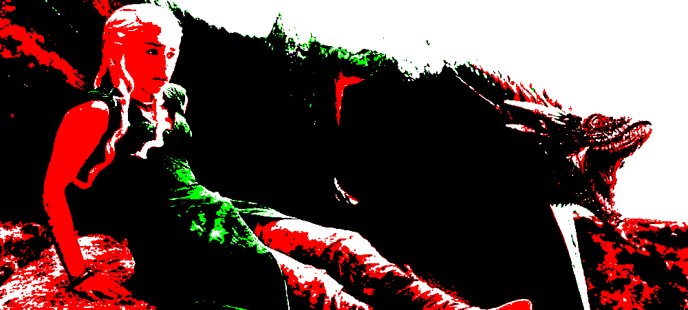

# VILLAIN Théo & MASSUARD Charles

## Partie 1

### Question 2

- Ouverture de l'image :
```rs
let img = image::open("../imgs/tyrion.jpg").unwrap();
```

Ce type correspond à une image pouvant avoir différents formats de pixels et canaux.

- Pour obtenir une image en mode rgb8 :
```rs
let rgb_img = img.to_rgb8();
```

- Ouverture de l'image passée en argument :
```rs
let args: DitherArgs = argh::from_env();
let path_in = args.input;
let path_out = args.output.unwrap_or_else(|| "output.png".to_string());

let img_input = image::open(path_in).unwrap();
```

### Question 3

Si l'image de départ a un canal alpha *(stark.png)*, l'image rgb8 sauvegardée *(stark_rgb.png)* n'a plus le canal alpha et donc sa transparence est supprimée. Nous remarquons qu'une partie de la transparence, ici l'arrière-plan, est remplie en blanc, tandis qu'une autre partie a des nuances de couleurs prenant en compte les couleurs de l'image de base.


<br>
*Image de base avec un canal alpha*


<br>
*Image rgb8 obtenue*

### Question 4

```rs
fn get_couleurs_pixel(img: &RgbImage, x: u32, y: u32) -> Rgb<u8>{
    *img.get_pixel(x, y)
}
```  

Avec ```img = rgb_img (stark_rgb.png)```, ```x = 32``` et ```y = 52```, on obtient :  

```Rgb([20, 20, 22])```

### Question 5

```rs
fn pixel_to_white(img: &mut RgbImage) {
    for (x, y, pixel) in img.enumerate_pixels_mut() {
        if (x + y) % 2 == 0 { // Si la somme des coordonnées est paire
            *pixel = Rgb([255, 255, 255]); // Blanc
        }
    }
}
```

*Note : Afin de modifier les datas d'une image, __&mut__ doit être utilisé. Ainsi, afin de lancer une fonction modifiant les datas de l'image telle que celle-ci, il faut tout d'abord la cloner en tant que mut et appeler la fonction avec :*

```rs
let mut mut_img_input_rgb = img_input_rgb.clone();
pixel_to_white(&mut mut_img_input_rgb);
```

L'image obtenue est reconnaissable.


<br>
*Image de base*


<br>
*Image obtenue ayant 1 pixel sur 2 en blanc*


<br>
*Image montrant qu'un pixel sur deux est blanc*


## Partie 2

### Question 6

Afin de récupérer la luminosité d'un pixel, nous pouvons la calculer en calculant la moyenne de ces valeurs RGB :

$$ luminositeMoyenne = {R + G + B \over 3} $$

En Rust, cela correspond à :

```rs
fn get_luminosite_pixel(img: $image::RgbImage, x: u32, y: u32) -> f32 {
    let pixel = img.get_pixel(x, y);
    let r = pixel[0] as f32;
    let g = pixel[1] as f32;
    let b = pixel[2] as f32;
    return (r+g+b) / 3.0;
}
```

Avec ```img = rgb_img (stark_rgb.png)```, ```x = 32``` et ```y = 52```, on obtient :  

```Luminosité du pixel en 32, 52 : 20.666666```

### Question 7

```rs
fn traitement_monochrome(img: &mut RgbImage){
    for y in 0..img.height() {
        for x in 0..img.width() {
            let luminosite = get_luminosite_pixel(img, x, y);
            if luminosite > 128.0 {
                img.put_pixel(x, y, Rgb([255, 255, 255]));
            } else {
                img.put_pixel(x, y, Rgb([0, 0, 0]));
            }
        }
    }
}
```


<br>
*Image de Tyrion après le traitement monochrome en noir et blanc*

### Question 8

Afin de permettrer à l'utilisateur de remplacer les couleurs pour le monochorme, nous devons effectuer plusieurs étapes :

- Créer les arguments et les rendre optionels :

```rs
#[derive(Debug, Clone, PartialEq, FromArgs)]
#[argh(subcommand, name="seuil")]
/// Rendu de l’image par seuillage monochrome.
struct OptsSeuil {
    /// la couleur1 choisie par l'utilisateur pour le seuil monochrome
    #[argh(option)]
    couleur1 : Option<String>,

    /// la couleur2 choisie par l'utilisateur pour le seuil monochrome
    #[argh(option)]
    couleur2 : Option<String>,
}
```

- Il faut ensuite récupérer les arguments et les transformer en RGB :

```rs
// Fonction pour récupérer les couleurs à partir des arguments
fn get_couleurs_from_args(mode: &Mode) -> (Rgb<u8>, Rgb<u8>) {
    match mode {
        Mode::Seuil(opts) => {
            let couleur1 = opts.couleur1.clone().unwrap_or_else(|| "0,0,0".to_string()); // Valeur par défaut noire
            let couleur2 = opts.couleur2.clone().unwrap_or_else(|| "255,255,255".to_string()); // Valeur par défaut blanche

            // Conversion des chaînes en Rgb
            let couleur1 = parse_rgb(&couleur1);
            let couleur2 = parse_rgb(&couleur2);

            (couleur1, couleur2)
        },
        _ => (Rgb([0, 0, 0]), Rgb([255, 255, 255])), // Valeurs par défaut si pas de couleur spécifiée
    }
}

// Fonction pour convertir une chaîne de caractères en Rgb<u8>
fn parse_rgb(rgb_str: &str) -> Rgb<u8> {
    let parts: Vec<u8> = rgb_str.split(',')
                                .map(|s| s.trim().parse().unwrap_or(0)) // Parse chaque partie en u8
                                .collect();
    Rgb([parts[0], parts[1], parts[2]])
}
```

- On modifie enfin la fonction ```traitement_monochrome``` :

```rs
fn traitement_monochrome(img: &mut RgbImage, couleur1: Rgb<u8>, couleur2: Rgb<u8>){
    for y in 0..img.height() {
        for x in 0..img.width() {
            let luminosite = get_luminosite_pixel(img, x, y);
            if luminosite > 128.0 {
                img.put_pixel(x, y, Rgb(couleur2.0));
            } else {
                img.put_pixel(x, y, Rgb(couleur1.0));
            }
        }
    }
}
```

Ainsi, si l'utilisateur lance le programme avec la commande suivante :

```cargo run -- ./imgs/tyrion.jpg ./imgs/tyrion_monochrome_sans_param.png seuil```

L'image retournée sera monochrome en noir et blanc car aucun paramètre n'est rentré.

Si l'utilisateur lance avec des paramètres tels que :

```cargo run -- ./imgs/battle_of_the_bastards.jpg ./imgs/battle_of_the_bastards_rouge_vert.png seuil --couleur1 "255, 0, 0" --couleur2 "0, 255, 0"``` 

L'image retournée sera monochrome avec les couleurs rouge et verte *(voir ci-dessous)*


<br>
*Image monochorme rouge et verte*

## Partie 3

### Question 9

Afin de calculer la distance entre 2 couleurs, nous allons utiliser la distance euclidienne :

$$ distanceCouleurs = {\sqrt{(r2-r1)^2 + (g2-g1)^2 + (b2-b1)^2}} $$

avec couleur1 = (r1, g1, b1) et couleur2 = (r2, g2, b2)

### Question 10

Afin de pouvoir changer les couleurs de l'image avec une palette, voici comment faire :

- Ajouter une option permettant à l'utilisateur de rentrer une palette personnalisée : 

```rs
#[derive(Debug, Clone, PartialEq, FromArgs)]
#[argh(subcommand, name="palette")]
/// Rendu de l’image avec une palette contenant un nombre limité de couleurs
struct OptsPalette {
    /// le nombre de couleurs à utiliser, dans la liste [NOIR, BLANC, ROUGE, VERT, BLEU, JAUNE, CYAN, MAGENTA]
    #[argh(option)]
    n_couleurs: usize,

    /// palette personnalisée fournie par l'utilisateur sous forme de chaîne (par exemple : "255,0,0;0,255,0;0,0,255")
    #[argh(option)]
    palette: Option<String>,
}
```

- Ajouter une fonction permettant de récupérer une palette par défaut

```rs
fn get_couleurs_palette() -> Vec<Rgb<u8>> {
    vec![
        Rgb([0, 0, 0]),      // Noir
        Rgb([255, 255, 255]), // Blanc
        Rgb([255, 0, 0]),     // Rouge
        Rgb([0, 255, 0]),     // Vert
        Rgb([0, 0, 255]),     // Bleu
        Rgb([255, 255, 0]),   // Jaune
        Rgb([0, 255, 255]),   // Cyan
        Rgb([255, 0, 255]),   // Magenta
    ]
}
```

- Ajouter une fonction permettant de récupérer les couleurs de la palette saisie par l'utilisateur :

```rs
fn parse_palette(palette_str: &str) -> Vec<Rgb<u8>> {
    palette_str
        .split(';')  // Séparer par des points-virgules (chaque couleur est séparée par un point-virgule)
        .map(|color_str| {
            let parts: Vec<u8> = color_str.split(',')
                                          .map(|s| s.trim().parse().unwrap_or(0)) // Convertir chaque composant de couleur en u8
                                          .collect();
            Rgb([parts[0], parts[1], parts[2]]) // Retourner un objet Rgb
        })
        .collect()
}
```

- Ajouter la fonction de distance entre deux couleurs :

```rs
fn distance_rgb(couleur1: Rgb<u8>, couleur2: Rgb<u8>) -> f32 {
    let r_diff = couleur2[0] as f32 - couleur1[0] as f32;
    let g_diff = couleur2[1] as f32 - couleur1[1] as f32;
    let b_diff = couleur2[2] as f32 - couleur1[2] as f32;
    (r_diff * r_diff + g_diff * g_diff + b_diff * b_diff).sqrt()
}
```

- Ajouter la fonction permettant de traiter et modifier l'image :

```rs
fn traiter_palette(img: &mut RgbImage, palette: &[Rgb<u8>]) {
    for y in 0..img.height() {
        for x in 0..img.width() {
            let pixel = *img.get_pixel(x, y);
            // Trouver la couleur la plus proche dans la palette
            let mut min_distance = f32::MAX;
            let mut best_color = Rgb([0, 0, 0]);

            for color in palette {
                let dist = distance_rgb(pixel, *color);
                if dist < min_distance {
                    min_distance = dist;
                    best_color = *color;
                }
            }
            img.put_pixel(x, y, best_color);
        }
    }
}
```

- Modifier la fonction **main** afin de prendre en compte ce nouveau Mode :

```rs
...
match args.mode {
        Mode::Seuil(_) => {
            let (couleur1, couleur2) = get_couleurs_from_args(&args.mode);
            traitement_monochrome(&mut mut_img_input_rgb, couleur1, couleur2);
            mut_img_input_rgb.save(path_out).unwrap();
        },
        Mode::Palette(opts) => {
            let palette = if let Some(palette_str) = opts.palette {
                parse_palette(&palette_str)
            } else {
                // Si aucune palette n'est fournie, utiliser une palette par défaut
                get_couleurs_palette().into_iter().take(opts.n_couleurs).collect()
            };

            // Vérifier si la palette est vide ou incorrecte
            if palette.is_empty() {
                eprintln!("Erreur : la palette ne peut pas être vide.");
                return;
            }

            traiter_palette(&mut mut_img_input_rgb, &palette);
            mut_img_input_rgb.save(path_out).unwrap();
        }
    }
...
```

Ainsi, nous pouvons maintenant utiliser ce nouveau mode :

- Exemple 1 : utilisation de la palette par défaut (pas de paramètres) avec 8 couleurs :

```cargo run -- ./imgs/daenerys.jpeg ./imgs/daenerys_palette_default.png palette --n-couleurs 8```


<br>
*Image de Daenerys modifié avec 8 couleurs de la palette par défaut*

- Exemple 2 : utilisation de la palette par défaut (pas de paramètres) avec 4 couleurs :

```cargo run -- ./imgs/daenerys.jpeg ./imgs/daenerys_palette_default.png palette --n-couleurs 4```


<br>
*Image de Daenerys modifié avec 4 couleurs de la palette par défaut*

- Exemple 3 : utilisation d'une palette personnalisée (Rouge, Bleu, Vert)'

```cargo run -- ./imgs/daenerys.jpeg ./imgs/daenerys_palette_rgb.png palette --n-couleurs 3 --palette "255,0,0;0,255,0;0,0,255"```


<br>
*Image de Daenerys modifié avec une palette rouge, vert, bleu*

- Exemple 4 : utilisation d'une palette de 12 couleurs aléatoires'

``` cargo run -- ./imgs/daenerys.jpeg ./imgs/daenerys_palette_rgb_aleatoire_12.png palette --n-couleurs 12 --palette "25,99,198;191,188,179;80,177,35;80,188,8;194,125,10;240,197,117;36,255,38;62,239,159;196,156,104;29,230,22;20,160,220;83,83,134"```


<br>
*Image de Daenerys modifié avec une palette de 12 couleurs aléatoires*